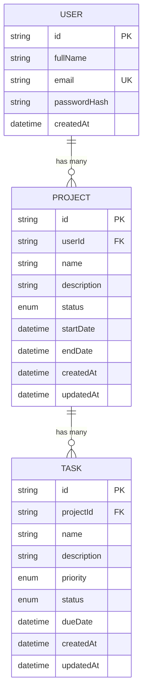

# TaskFlow Database Entity-Relationship (ER) Documentation

This document describes the relational database schema, data model entities, relationships, constraints, and cascade deletion behaviors for the TaskFlow backend. The database is managed via PostgreSQL and Prisma ORM.

---

## Entity-Relationship Diagram



---

## Entity Specifications

### 1. `User` Model
Represents registered users in the system who own projects and tasks.

| Column | Type | Constraints | Description |
| --- | --- | --- | --- |
| `id` | UUID / String | Primary Key, Auto-generated (`uuid()`) | Unique user identifier |
| `fullName` | String | Not Null | Display name of the user |
| `email` | String | Not Null, Unique (`@unique`) | Email address used for authentication |
| `passwordHash` | String | Not Null | bcrypt hashed password |
| `createdAt` | DateTime | Not Null, Default `now()` | Timestamp of account registration |

---

### 2. `Project` Model
Represents projects created by a user to group and organize related tasks.

| Column | Type | Constraints | Description |
| --- | --- | --- | --- |
| `id` | UUID / String | Primary Key, Auto-generated (`uuid()`) | Unique project identifier |
| `userId` | UUID / String | Foreign Key (`User.id`), Not Null | Owner of the project |
| `name` | String | Not Null | Name or title of the project |
| `description` | String | Nullable | Detailed project description |
| `status` | `ProjectStatus` Enum | Not Null, Default `NOT_STARTED` | Current progress state |
| `startDate` | DateTime | Nullable | Planned start timestamp |
| `endDate` | DateTime | Nullable | Planned completion deadline |
| `createdAt` | DateTime | Not Null, Default `now()` | Timestamp of project creation |
| `updatedAt` | DateTime | Not Null, Auto-updated (`@updatedAt`) | Timestamp of last modification |

---

### 3. `Task` Model
Represents individual actionable items assigned within a specific project.

| Column | Type | Constraints | Description |
| --- | --- | --- | --- |
| `id` | UUID / String | Primary Key, Auto-generated (`uuid()`) | Unique task identifier |
| `projectId` | UUID / String | Foreign Key (`Project.id`), Not Null | Associated parent project |
| `name` | String | Not Null | Title or name of the task |
| `description` | String | Nullable | Detailed task description |
| `priority` | `Priority` Enum | Not Null, Default `MEDIUM` | Importance / priority level |
| `status` | `TaskStatus` Enum | Not Null, Default `PENDING` | Current execution status |
| `dueDate` | DateTime | Nullable | Target due date and time |
| `createdAt` | DateTime | Not Null, Default `now()` | Timestamp of task creation |
| `updatedAt` | DateTime | Not Null, Auto-updated (`@updatedAt`) | Timestamp of last modification |

---

## Relationships & Cardinality

### 1. User to Project (`1 : N`)
- **Relationship Type**: One-to-Many
- **Description**: A single `User` can create and own zero, one, or many `Project` records (`USER ||--o{ PROJECT`).
- **Foreign Key**: `Project.userId` references `User.id`.
- **Tenancy Boundary**: All project access is strictly verified against `userId`. No user can view or modify another user's projects.

### 2. Project to Task (`1 : N`)
- **Relationship Type**: One-to-Many
- **Description**: A `Project` contains zero, one, or many `Task` records (`PROJECT ||--o{ TASK`).
- **Foreign Key**: `Task.projectId` references `Project.id`.
- **Tenancy Propagation**: Tasks are indirectly owned by users through the `Project.userId` relationship (`Task -> Project -> User`).

---

## Cascade Deletion Behavior

The database schema specifies automated cascade deletions using Prisma's `onDelete: Cascade` rules:

```prisma
// Project relation in User
user User @relation(fields: [userId], references: [id], onDelete: Cascade)

// Task relation in Project
project Project @relation(fields: [projectId], references: [id], onDelete: Cascade)
```

1. **User Deletion**:
   - If a `User` record is deleted, all `Project` records associated with that `User` are automatically removed by PostgreSQL foreign key cascades.
   - Deletion of those projects subsequently triggers cascade deletion of all child `Task` records.
   - No orphan project or task records remain.

2. **Project Deletion**:
   - When a `Project` record is deleted (via `DELETE /api/projects/:id`), all associated `Task` records referencing that project (`Task.projectId = Project.id`) are deleted immediately in the database.
   - Preserves referential integrity without requiring manual bulk-delete queries in application code.

---

## Enumerated Types (Enums)

TaskFlow utilizes PostgreSQL native enums to enforce strict domain validation at the database layer.

### 1. `ProjectStatus`
Tracks the lifecycle status of a project:
- `NOT_STARTED` *(Default)*: The project has been scheduled or created but active work has not begun.
- `IN_PROGRESS`: The project is actively underway.
- `COMPLETED`: All deliverables for the project have been finalized.

### 2. `TaskStatus`
Tracks execution state of individual tasks:
- `PENDING` *(Default)*: Task is in the backlog or awaiting commencement.
- `IN_PROGRESS`: Task is currently being worked on.
- `COMPLETED`: Work on the task is finished.

### 3. `Priority`
Designates the urgency and importance of a task:
- `LOW`: Low priority / non-blocking task.
- `MEDIUM` *(Default)*: Normal priority task.
- `HIGH`: Critical, time-sensitive, or blocking task.

---

## Constraints and Indexes

1. **Primary Keys (`PK`)**:
   - `User.id`, `Project.id`, and `Task.id` use RFC 4122 UUID format (`@id @default(uuid()) @db.Uuid`). This guarantees globally unique identifiers across distributed environments and avoids sequential ID enumeration attacks.

2. **Unique Constraints (`UK`)**:
   - `User.email` has a unique constraint index (`@unique`). Attempting to register two accounts with the same email address triggers a unique violation in the database and is caught by application logic to return `409 Conflict`.

3. **Foreign Key Constraints (`FK`)**:
   - `Project.userId` references `User(id)` with `ON DELETE CASCADE`.
   - `Task.projectId` references `Project(id)` with `ON DELETE CASCADE`.
